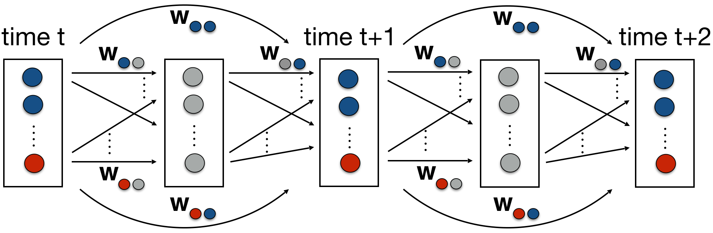

# HD-MILP-Plan

Hybrid Deep MILP Planner (HD-MILP-Plan) is a two-stage planner based on the learning and planning framework [1,2] that (i) learns the state transition function T(st,at) = st+1 of a factored planning problem using Densely Connected Neural Networks [3] from data, and (ii) compiles multiple copies of the learned transition function T'(...T'(T'(T'(I,a0),a1),a2)...) = G (as visualized by Figure 1) into MILP and solves it using off-the-shelf MILP solver [4]. HD-MILP-Plan can handle discrete/continuous action and state spaces, arbitrarily complex state transition functions, linear constraints on actions/states and linear reward functions.

Figure 1: Visualization of the learning and planning framework presented in [1] where red circles represent action variables, blue circles represent state variables, gray circles represent the activation units and w's represent the weights of the neural network.

## Improvements

HD-MILP-Plan

i) includes parsers for domain files that read in linear expressions of form: sum1..i..n ai xi ? k where ? can be <=, >= or == and ai is a constant real number. See translation folder for more details.

ii) handles goal (state) constraints. 

iii) can make use of known transition functions. See example transition files under translation folder for more details. HD-MILP-Plan will be prompted to encode known transition functions only when a strict subset of states are predicted by the DNNs.

iv) can handle discrete state variables with a) boolean domains that are learned with step function, and b) integer domains that are learned with linear function. For b), the prediction value is rounded to the nearest integer during optimization.

## Dependencies

i) Data collection (input to training DNN): Data is collected using the RDDL-based domain simulator [5]. 

ii) Training DNN: The toolkit [6] is used to train DNNs. The final training parameters were recorded into dnn.txt file.

iii) Solver: Any off-the-shelf MILP solver works. In our paper [1], we used CPLEX solver [4].

For i) any domain simulator and for ii) any DNN training toolkit works. Example dnn.txt and domain files (under translation folder) are provided for navigation, hvac and reservoir domains. Therefore to run the planner, you will only need iii).

## Running HD-MILP-Plan

hd_milp_plan.py -d domain -i instance -h horizon -b bound -s sparsify (optional, set to 0.0 by default)

Example: python hd_milp_plan.py -d hvac -i 3 -h 10 -b False

## Verification Task

HD-MILP-Plan can also be used to verify different properties of DNNs by setting horizon -h to 1.

## Implementation Notes

HD-MILP-Plan is re-written with some minor implementation differences from the original implementation including:

i) the current implementation is in Python as opposed to the original implementation that was in C++.

ii) ability to handle discrete state variables (as mentioned above).

iii) the ability to handle goal constraints (as mentioned above).

iv) the ability to handle known transition functions (as mentioned above).

v) not connected to the RDDL simulator [5] (to connect to the RDDL simulator, you simply need to feed the first executed actions at time 0 to the rddlclient.c via console, and reduce the horizon by 1 at each iteration of the planning loop).

vi) the number of parallel threads is set to 1 as opposed to 32.

vii) no total time limit is set for planning.

viii) total time limit for preprocessing is set to a deterministic constant value (i.e. 30,000 ticks). Allocating more time can significantly improve your planning performance especially for DNNs with more than 1 hidden layers.

## Summary

| Action Space | State Space  | DNN Type | Global Constraints  | Reward Optimization | Known Transition Functions | Optimality Guarantee w.r.t. DNN
| :-: | :-: | :-: | :-: | :-: | :-: | :-: |
| Discrete and Continuous | Discrete and Continuous | Densely-connected DNNs with ReLU activation units | Yes, Piecewise Linear | Yes, Piecewise Linear | Yes, Piecewise Linear | Yes |

## Citation

If you are using HD-MILP-Plan, please cite the paper [1].

## References
[1] Buser Say, Ga Wu, Yu Qing Zhou, and Scott Sanner. [Nonlinear hybrid planning with deep net learned transition models and mixed-integer linear programming](https://www.ijcai.org/proceedings/2017/0104.pdf). In 26th IJCAI, pages 750–756, 2017.

[2] Ga Wu, Buser Say, and Scott Sanner. [Scalable Planning with Deep Neural Network Learned Transition Models](https://www.jair.org/index.php/jair/article/view/11829). JAIR, Volume 68, pages 571–606, 2020.

[3] Gao Huang, Zhuang Liu, and Kilian Weinberger. Densely connected convolutional networks. 2016.

[4] IBM ILOG CPLEX Optimization Studio CPLEX User's Manual, 2017.

[5] Scott Sanner. Relational dynamic influence diagram language (rddl): Language description. 2010.

[6] Ga Wu. [Github repository](https://github.com/wuga214/PAPER_IJCAI17_HybridPlanning_NeuralNetwork_MILP).
